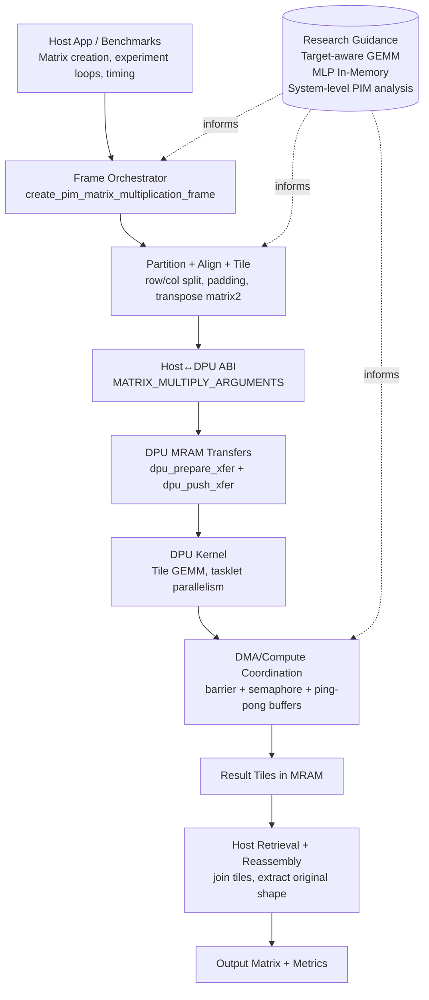

# PIM Matrix Multiplication Benchmarks

This project provides a reference implementation of matrix multiplication using Processing-In-Memory (PIM) capabilities of UPMEM DPUs. To that end it implements a matrix Tiling Schema and a host program to orchestrate the distributed computation across DPUs. 

The project also includes a set of benchmarks and unit tests to validate the implementation, a CMake-based build system for easy compilation and integration, and a Docker Compose setup for consistent development and testing environments. One of the goals for the project is to be easily integrated into other CMake-based projects, so the library is designed to be modular and reusable.

Possible application domains for this project include deep learning, scientific computing, and any other domain that relies heavily on matrix operations. By leveraging the computational capabilities of DPUs, this project aims to provide significant performance improvements for matrix multiplication tasks, which are fundamental to many applications in these domains.

It could be used to serve as a backend for higher-level libraries or frameworks such as TensorFlow or PyTorch that require efficient matrix multiplication, or as a standalone library for applications that need to perform large-scale matrix operations.

It is important to note that this project is a reference implementation and may not be optimized for all use cases. Future work could include further optimizations, support for additional matrix operations, and integration with other libraries and frameworks.

While the raw performance of this implementation does not match the performance of highly optimized GPU-based libraries, it serves as a starting point for exploring the potential of PIM for matrix multiplication and provides a foundation for future optimizations and improvements. This project focuses on demonstrating the scaling potential of PIM for matrix multiplication, and the performance results should be interpreted in that context. The goal is to show how performance can improve as we scale up the number of DPUs, rather than achieving the highest possible performance on a single DPU or a small number of DPUs.

It can be used as a reference for researchers and developers interested in exploring the potential of PIM for matrix multiplication, and as a starting point for further optimizations and improvements in this area. 

## Table of Contents
- [Architecture Overview](#architecture-overview)
- [Prerequisites](#prerequisites)
- [Getting Started](#getting-started)
  - [Git LFS Setup](#git-lfs-setup)
  - [Building with Docker](#building-with-docker)
  - [Building with CMake Directly](#building-with-cmake-directly)
- [Integration Guide](#integration-guide)
- [Documentation](#documentation)
- [Roadmap](#roadmap)
- [Acknowledgements](#acknowledgements)

## Architecture Overview

This project is designed as a **host-orchestrated PIM compute pipeline** for GEMM-style workloads.  
It combines explicit host-side scheduling with DPU-local tiled compute so teams can benchmark scaling, prototype optimizations quickly, and integrate into larger ML/HPC stacks with minimal friction.

### Value Proposition

- **Composable Integration**: clean C API and CMake integration for drop-in use in existing systems.
- **Scalable Decomposition**: matrix partitioning across DPU work groups and tasklets.
- **Dataflow-Aware Layout**: host-side tiling and matrix transformations aligned to DPU memory behavior.
- **Performance Engineering Ready**: explicit separation of transfer, launch, and retrieval phases for measurement and tuning.
- **Research-to-Product Bridge**: architecture matches optimization themes from the cited PIM literature (target-aware layout, overlap of communication and compute, sustained throughput focus).

### Layered Architecture

1. **Host Application Layer**
    - Benchmarks/tests and external applications construct matrices and invoke the PIM API.
    - Responsible for experiment orchestration, iteration loops, and timing breakdowns.

2. **Host Runtime & Orchestration Layer**
    - `pim_matrix_multiplication_frame_t` stores execution metadata: DPU set, offsets, tile geometry, data types, and validity state.
    - Computes padding/alignment and memory frame layout per DPU.
    - Splits input matrices into DPU-targeted submatrices, converts to tiled format, and schedules transfers.

3. **Host↔DPU Contract Layer**
    - `dpu_pim_matrix_multiply_kernel_arguments_t` defines the binary ABI between host and kernel.
    - Encodes MRAM offsets, aligned dimensions, original dimensions, tile sizes, and type sizes.
    - Enables a single kernel implementation to handle multiple matrix shapes safely.

4. **DPU Kernel Execution Layer**
    - Tile-based GEMM kernel with tasklet specialization:
       - tasklet 0 for DMA/load-store orchestration,
       - remaining tasklets for compute.
    - Uses barriers, semaphores, and ping-pong buffers to coordinate transfer and compute phases.

5. **Result Assembly Layer**
    - Host retrieves tiled per-DPU outputs, reconstructs global matrix via row/column joins, then crops to original dimensions.

### How Data Is Split Across Multiple DPUs

For an input multiplication $C = A \times B$ where:

- $A \in \mathbb{Z}^{M \times K}$
- $B \in \mathbb{Z}^{K \times N}$
- $C \in \mathbb{Z}^{M \times N}$

the host maps DPUs as a 2D logical grid:

- **row partitions** = `work_group_size`
- **column partitions** = `num_work_groups`
- **total DPUs** = `work_group_size * num_work_groups`

Each DPU is responsible for one output block $C_{r,c}$ and receives:

- one **row-slice of A**: approximately $\frac{M}{\text{work group size}} \times K$
- one **column-slice of B**: approximately $K \times \frac{N}{\text{num work groups}}$

So instead of multiplying full-size matrices on every device, each DPU multiplies a much smaller pair of submatrices. In practice, dimensions are padded/aligned (work-group split, 8-byte alignment, then tile alignment), but the effective compute region still corresponds to that reduced block shape.

#### Why this reduces per-device workload

- Per-DPU output footprint drops from $M \times N$ to roughly:
   $$\frac{M}{\text{work group size}} \times \frac{N}{\text{num work groups}}$$
- Per-DPU input footprint also shrinks by distributing rows of $A$ and columns of $B$.
- The inner $K$ accumulation remains local inside each DPU for correctness of each output block.

#### How the full result is reconstructed

1. Host fetches each DPU's partial result block from MRAM.
2. Blocks in the same row partition are **joined by columns**.
3. The resulting row-strips are **joined by rows**.
4. Final matrix is cropped back to the original $(M \times N)$ shape (removing alignment padding).

This guarantees that distributed block computations produce the same complete result as a monolithic multiplication, while reducing memory and compute pressure on each individual DPU. Furthermore it doesn't require any inter-DPU communication since each DPU computes an independent output block, making it a good fit for the UPMEM architecture.

### Architecture Diagram



### Core Data Structures and Why They Matter

- **`Matrix`**
   - Generic host-side matrix abstraction with split/join/transpose/tile conversion helpers.
   - Enables clean preprocessing and postprocessing without leaking DPU details to application code.

- **`pim_matrix_multiplication_frame_t`**
   - Captures the full execution plan (work-group topology, tile geometry, MRAM layout, data widths).
   - Keeps repeated runs efficient by reusing orchestration metadata.

- **`dpu_pim_matrix_multiply_kernel_arguments_t`**
   - Stable, explicit ABI for safe kernel launches.
   - Preserves correctness on boundary tiles by carrying both aligned and original dimensions.

- **Kernel-local WRAM ping-pong buffers (`matrix1_wram[2]`, `matrix2_wram[2]`, `result_wram[2]`)**
   - Fundamental building block for overlapping data movement and compute.
   - Reduces idle cycles and supports sustained throughput as problem size and DPU count grow.

## Prerequisites

- **Git LFS**: Required for downloading the UPMEM SDK tarball
- **CMake**: Version 3.20 or higher
- **Python**: Python 3.7 or higher with `pyyaml` package
- **UPMEM SDK**: Version 2023.2.0 (included via Git LFS)
- **Docker** (optional): For containerized builds and testing

## Getting Started

### Git LFS Setup

This repository uses Git Large File Storage (LFS) to manage the UPMEM SDK tarball (`lib/upmem.tar.gz`). You must have Git LFS installed and configured before cloning or pulling the repository.

#### Install Git LFS

**macOS:**
```bash
brew install git-lfs
```

**Ubuntu/Debian:**
```bash
sudo apt-get install git-lfs
```

#### Initialize Git LFS

After installing Git LFS, initialize it:
```bash
git lfs install
```

#### Clone the Repository

If you haven't cloned yet:
```bash
git clone <repository-url>
cd pim-matmul-benchmarks
```

If you've already cloned without Git LFS:
```bash
git lfs fetch
git lfs pull
```

Verify that the UPMEM SDK was downloaded correctly:
```bash
ls -lh lib/upmem.tar.gz  # Should show actual file size (~100MB+), not a few KB
```

### Building with Docker

Docker provides a consistent build environment with all dependencies pre-configured.

#### Build the Docker Image

```bash
docker-compose build dev
```

#### Interactive Development Environment

Start an interactive shell with the project mounted:
```bash
docker-compose run --rm dev
```

Inside the container, source the environment and build:
```bash
source /opt/upmem-2023.2.0-Linux-x86_64/upmem_env.sh simulator
source /workspace/source.me
mkdir -p build
cmake -S . -B build
make -C build all
```

#### One-Step Build

Build the entire project in one command:
```bash
docker-compose run --rm build
```

#### Run Unit Tests

Execute all unit tests:
```bash
docker-compose run --rm unittest
```

#### Docker Compose Services

- **dev**: Interactive development environment with full project access
- **build**: Automated build service that compiles the project
- **unittest**: Runs all unit tests via CTest

### Building with CMake Directly

For native builds on your host system, follow these steps.

#### 1. Install System Dependencies

**Ubuntu/Debian:**
```bash
sudo apt-get update
sudo apt-get install -y build-essential cmake git-lfs \
    python3 python3-pip doxygen \
    libelf-dev libnuma-dev libgomp1 \
    pkg-config gdb
```

**macOS:**
```bash
brew install cmake git-lfs python doxygen pkg-config
```

#### 3. Set Up Python Environment

```bash
# Source the project environment script
source source.me

# Or manually set up Python environment
python3 -m venv scripts/pim-matmul-env
source scripts/pim-matmul-env/bin/activate
pip install --upgrade pip
pip install pyyaml
```

#### 4. Configure and Build

```bash
# Configure the project
mkdir -p build
cmake -S . -B build

# Build all targets
make -C build all

# Or use CMake directly
cmake --build build

# Build specific targets
make -C build pim_matmul        # Build library only
make -C build tests             # Build tests only
make -C build benchmarks        # Build benchmarks only
```

#### 5. Run Tests

```bash
# Run all tests
cd build
ctest --output-on-failure -V

# Run specific test
./tests/test_matrix_create_from_2d_array_and_free
```

#### CMake Configuration Options

Customize the build with CMake options:

```bash
cmake -S . -B build \
  -DBUILD_TESTS=ON \                    # Enable/disable tests (default: ON)
  -DBUILD_BENCHMARKS=ON \                # Enable/disable benchmarks (default: ON)
  -DPARAMS_FILE=path/to/params.yaml \    # Custom params file
  -DCMAKE_BUILD_TYPE=Release             # Release or Debug (default: Debug)
```

## Integration Guide

To integrate this PIM matrix multiplication framework into your existing CMake-based project:

### Method 1: Add as Subdirectory

1. **Add the project as a subdirectory** (e.g., via git submodule or copying):
   ```bash
   git submodule add <repository-url> external/pim-matmul-benchmarks
   ```

2. **In your project's CMakeLists.txt**, add:
   ```cmake
   # Add PIM matmul subdirectory
   add_subdirectory(external/pim-matmul-benchmarks)
   
   # Link your target to the PIM library
   target_link_libraries(your_target PRIVATE pim_matmul)
   ```

3. **Ensure UPMEM SDK is configured** in your environment before running CMake:
   ```bash
   export PKG_CONFIG_PATH="/opt/upmem-2023.2.0-Linux-x86_64/share/pkgconfig:${PKG_CONFIG_PATH}"
   export PATH="/opt/upmem-2023.2.0-Linux-x86_64/bin:${PATH}"
   source /opt/upmem-2023.2.0-Linux-x86_64/upmem_env.sh simulator
   ```

### Method 2: Install and Use find_package

1. **Build and install the library**:
   ```bash
   cd pim-matmul-benchmarks
   mkdir -p build && cd build
   cmake -S .. -B . -DCMAKE_INSTALL_PREFIX=/usr/local
   make install
   ```

2. **In your project's CMakeLists.txt**:
   ```cmake
   find_package(pim_matmul REQUIRED)
   target_link_libraries(your_target PRIVATE pim_matmul)
   ```

### Using the API

Include the necessary headers in your code:

```c
#include "matrix.h"
#include "pim_matrix_multiplication_frame.h"

// Your code here
Matrix* matrixA = matrix_create_from_row_major_array(...);
Matrix* matrixB = matrix_create_from_row_major_array(...);
// Perform PIM multiplication...
```

### Key Integration Considerations

1. **UPMEM SDK Dependency**: Ensure the UPMEM SDK is installed and environment variables are set before building your project.

2. **DPU Binary Path**: The framework automatically builds and embeds the DPU kernel binary path. If you need a custom DPU binary:
   ```bash
   cmake -DPIM_MATMUL_DPU_BINARY_PATH=/path/to/your/dpu/binary ...
   ```

3. **Runtime Parameters**: Customize runtime behavior via `defn/params.yaml` or provide your own:
   ```bash
   cmake -DPARAMS_FILE=/path/to/your/params.yaml ...
   ```

4. **Include Directories**: The library automatically exports these include directories:
   - `src/` - Core library headers
   - `common/` - Common utilities and helpers
   - `lib/simplepim/` - SimplePIM library

5. **Required Libraries**: The framework links against:
   - UPMEM DPU libraries (via `dpu-pkg-config`)
   - Math library (`-lm`)

## Documentation

- **API Documentation**: Refer to the inline documentation in header files or generate Doxygen docs:
  ```bash
  doxygen Doxyfile
  ```
  
- **Build Targets**: View available make targets:
  ```bash
  make help  # If using the project's Makefile
  ```

- **Examples**: See `benchmarks/` directory for usage examples:
  - `1gb_square_benchmark.c` - Large square matrix multiplication
  - `back_to_back_multiplication_benchmark.c` - Sequential multiplications
  - `test_from_file.c` - Loading matrices from files

## License

See [LICENSE](LICENSE) for details.

## Roadmap

Optimising **Sustained Performance** - the performance achieved when considering the entire end-to-end execution time, including data transfers and setup overheads. This is crucial for real-world applications where the total time to solution matters more than just the raw computation speed.
- Creating an optimized DPU kernel and host routines that parallelize the computation with data transfers between host and DPUs, overlapping communication and computation to minimize idle time.
- As some of the previous works outline - the performance of PIM-based solutions can be significantly impacted by the overhead of data transfers between the host and DPUs. To address this, we will explore techniques to overlap communication and computation, such as using asynchronous data transfers and double buffering, to ensure that the DPUs are kept busy while data is being transferred.
- This will hopefully lead to a more accurate representation of the performance benefits of PIM for matrix multiplication in real-world scenarios, where the total execution time is a critical factor and lay the groundwork for further optimizations and improvements in the future.
Tests show the scaling of this metric on the current implementation is not ideal, and we will explore various techniques to improve it.

Application Specific optimizations - tailoring the matrix multiplication implementation to specific application domains, such as deep learning or scientific computing, where certain patterns of matrix operations are common. This could involve optimizing for specific matrix sizes, sparsity patterns, or data types that are prevalent in these applications.

## Acknowledgements

- [Accelerating LLMs using an Efficient GEMM Libraryand Target-Aware Optimizations on Real-World PIMDevices](https://dl.acm.org/doi/epdf/10.1145/3696443.3708953)

- [Processing Multi-Layer Perceptrons In-Memory](https://ieeexplore.ieee.org/document/10768222)

- [A Full-System Perspective on UPMEM Performance](https://dl.acm.org/doi/epdf/10.1145/3609308.3625266)

- [Benchmarking a New Paradigm: An Experimental Analysis of a Real Processing-in-Memory Architecture](https://arxiv.org/abs/2105.03814)

- [SimplePIM: A Software Framework for Productive and Efficient Processing-in-Memory](https://arxiv.org/abs/2310.01893)

- [Tesseract: Parallelize the Tensor Parallelism Efficiently](https://arxiv.org/abs/2105.14500#:~:text=To%20solve%20these%20problems%2C%20we%20propose%20Tesseract%2C%20a,and%20lowers%20the%20memory%20required%20for%20each%20GPU.)

- [Megatron-LM: Training Multi-Billion Parameter Language Models Using
Model Parallelism](https://arxiv.org/pdf/1909.08053)
